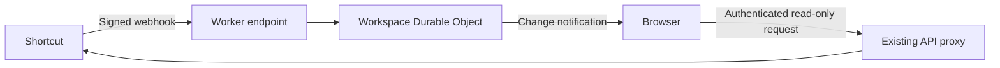

# Proposed live workspace updates

Status: proposal only, recorded September 11, 2026. No webhook endpoint, Durable Object, or live subscription is implemented. This document does not change the current deployment.

## Goal

Reflect Shortcut changes in the 3D field, counts, inspector, and workspace terminal without requiring a full manual refresh. Keep Shortcut access read-only and hosting inexpensive; occasional delayed updates are acceptable.

## Current architecture

The public app uses one Cloudflare Worker with static assets. `worker/index.js` provides an allowlisted, read-only Shortcut API proxy and encrypted session cookies. There is no shared workspace database or persistent connection service on Cloudflare.

Hosted browsers cache responses in IndexedDB through `src/browser-cache.js`. Entries have no automatic expiry; Refresh clears the scope and advances its generation to prevent stale requests from repopulating the cache. `src/loader.js` loads directories and details, but does not yet reconcile incremental external changes. Local development retains the Express proxy and disk cache.

## Recommended design

Keep the existing hosting and add a signed webhook endpoint plus one SQLite Durable Object per workspace. The object would keep a bounded change journal and notify authenticated browsers through hibernating WebSockets. It would not hold a complete copy of the workspace or persist user API tokens.

Treat webhook events as a reason to refetch authoritative data, rather than blindly applying their partial payloads to the model.

## Required changes

### 1. Register and authenticate workspace webhooks

- Provision a workspace-specific URL such as `/api/webhooks/shortcut/<registration-id>` and a signing secret, then configure them in Shortcut. Bind the registration to a verified workspace identity on the server; a URL identifier alone is not authentication.
- Verify `Payload-Signature`: Shortcut documents a hex-encoded HMAC-SHA256 over the raw UTF-8 request body using the configured secret. Validate before processing, bound request size, and avoid logging secrets or private payloads.
- Give this route its own signature authentication. Existing API routes require browser-specific origin and `X-Fsn-Client` checks that Shortcut cannot supply.
- Deduplicate webhook IDs. Confirm Shortcut's retry behavior before defining acknowledgement and failure handling.

Webhook setup is a separate workspace integration step. Users' API tokens can remain read-only. The exact workspace permissions and plan requirements for configuring webhooks still need verification.

### 2. Add a workspace change hub

- Add a Durable Object binding and SQLite migration in `wrangler.jsonc`, plus a Worker route for browser subscriptions.
- Validate the browser's session and workspace membership before subscribing. Derive the channel on the server; never trust a client-supplied workspace ID. The current session needs a verified workspace identity for this purpose.
- Store a bounded journal with a monotonic cursor, event IDs, and enough metadata to identify affected resources. Limit retention and handle duplicate or out-of-order deliveries.
- Send invalidation notices rather than full story content. Do not assume all workspace members have identical visibility: use coarse revision notices unless entity identifiers can be disclosed to that subscriber. Every subsequent data read remains authenticated with the user's own token.
- Close or revalidate subscriptions when sessions expire, users disconnect, or workspaces change.

### 3. Reconcile browser caches and the loaded model

- Invalidate affected story details, epic story lists, and directory metadata. A story move can affect both its old and new epic; archives and deletes must remove stale objects.
- Extend the proxy's GET allowlist if targeted entity reads require endpoints it does not currently expose.
- Add targeted cache revisions or equivalent protection so an older in-flight response cannot overwrite a newer update. Coordinate invalidation across browser tabs, preserving the existing scope isolation.
- Refetch affected loaded data, coalesce bursts, and respect Shortcut rate limits. Mark unloaded data stale for its next visit instead of fetching the entire workspace for every event.
- Update all visible occurrences and derived counts while preserving the camera, selection where possible, and terminal context. Handle deletion of the selected object explicitly.

### 4. Recover after disconnections

On reconnect, request events after the browser's last cursor. If retained history cannot cover the gap, reconcile cached data. Persisting a local cursor must not cause an interrupted cache update to be skipped on restart.

Keep manual Refresh and occasional reconciliation as fallbacks for missed events and unsupported entity types. Webhooks are not a complete synchronization protocol.

## Event coverage and open questions

[Shortcut's webhook documentation](https://developer.shortcut.com/api/webhook/v1/) describes story and epic creation, updates, and deletion, including comments, checklist tasks, and workflow changes from VCS integrations. Objectives are not explicitly documented; retain periodic or manual objective refresh until coverage is confirmed. Here, tasks means checklist items, not stories linked through a parent-story relationship.

The documented payload example has no workspace ID, so registration must establish workspace routing. Before implementation, verify real payloads for moves, archives, deletes, and tasks; webhook setup permissions; delivery retries; and whether objective events are available.

## Cost and alternatives

SQLite Durable Objects are available on Cloudflare's free tier. Hibernating WebSockets avoid duration charges while the object sleeps. A small audience may fit within free allowances, but webhook traffic, journal operations, connection activity, and follow-up API requests still consume quotas. Keep the journal bounded and avoid storing full workspace responses.

Polling a small workspace revision is an alternative if updates delayed by several seconds are acceptable. It simplifies browser connections but still needs shared server state and generates requests even when nothing changes, so it is not automatically cheaper. Start with hibernating WebSockets if implementing this proposal.

Check current [Durable Objects pricing](https://developers.cloudflare.com/durable-objects/platform/pricing/) and [Workers pricing](https://developers.cloudflare.com/workers/platform/pricing/) before rollout. No paid resources are required or enabled by this document.

## Implementation scope and validation

This would be a moderate Worker and data-loader feature, not a renderer rewrite. Decide how registrations and signing secrets are provisioned and rotated, and whether local development uses Wrangler for integration testing or also gets an Express webhook adapter. Shortcut cannot directly reach a loopback-only local server.

Before rollout, validate signature rejection, duplicate and reordered delivery, workspace isolation, expired sessions, reconnect gaps, stale in-flight cache writes, and story moves/archives/deletes. Confirm a real Shortcut change updates the field and counts without moving the camera or triggering any Shortcut write request.
